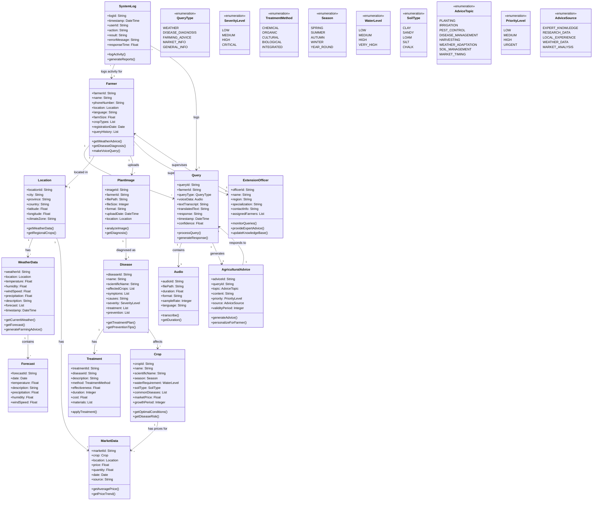

# AgriNathi System - Domain Class Diagram

## Overview
The domain class diagram represents the key entities (things) in the AgriNathi agricultural voice assistant system. These classes represent the core business concepts and their relationships.

## Class Descriptions

### Core Entities

1. **Farmer**: Represents the primary user of the system
   - Contains personal and farm information
   - Interacts with all system modules
   - Maintains query history

2. **Location**: Geographic information for weather and regional advice
   - Supports location-based services
   - Links to weather and market data

3. **Query**: Voice/text queries from farmers
   - Central to the voice assistant functionality
   - Links audio input to responses

### Agricultural Domain

4. **Crop**: Agricultural products and their characteristics
   - Links diseases, treatments, and market data
   - Contains growing requirements

5. **Disease**: Plant diseases and their management
   - Comprehensive disease information
   - Treatment and prevention strategies

6. **Treatment**: Disease treatment methods
   - Multiple treatment approaches
   - Effectiveness and cost information

### Data and Services

7. **WeatherData**: Weather information and forecasts
   - Real-time and forecast data
   - Agricultural advice generation

8. **MarketData**: Agricultural market prices
   - Price tracking and trends
   - Location-specific pricing

9. **PlantImage**: Images for disease diagnosis
   - Image processing and analysis
   - Diagnosis results

### System Support

10. **ExtensionOfficer**: Agricultural experts
    - System monitoring and support
    - Knowledge base updates

11. **SystemLog**: System activity tracking
    - Usage analytics and reporting
    - Performance monitoring

## Key Relationships

- **Farmer** is the central entity connecting to all other classes
- **Location** provides geographic context for weather and market data
- **Query** represents the main interaction point for voice services
- **Disease** and **Treatment** form the knowledge base for plant health
- **Crop** connects agricultural products to diseases and market data
- **ExtensionOfficer** provides human oversight and expertise

## Design Principles

1. **Single Responsibility**: Each class has a clear, focused purpose
2. **High Cohesion**: Related attributes and methods are grouped together
3. **Low Coupling**: Classes are loosely connected through well-defined relationships
4. **Domain-Driven Design**: Classes reflect real-world agricultural concepts
5. **Extensibility**: Easy to add new crops, diseases, and treatments