# AgriNathi System - Sequence Diagrams

## Overview
This document contains simplified sequence diagrams for key use cases in the AgriNathi agricultural voice assistant system. Each diagram shows the interaction flow between actors and system components.

## 1. Voice Query Processing (UC-1 to UC-5)

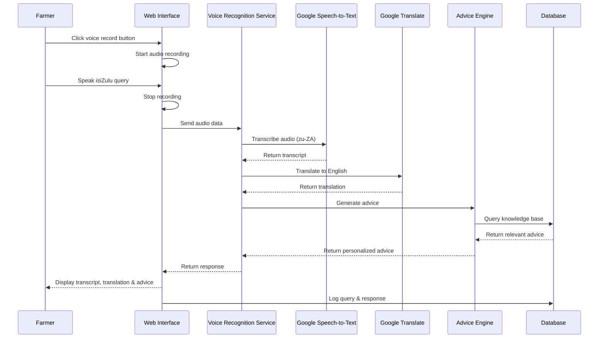

## 2. Weather Information Retrieval (UC-6 to UC-10)

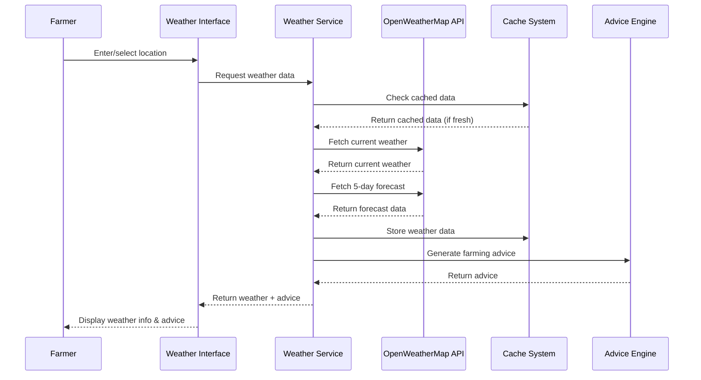

## 3. Plant Disease Diagnosis (UC-11 to UC-16)

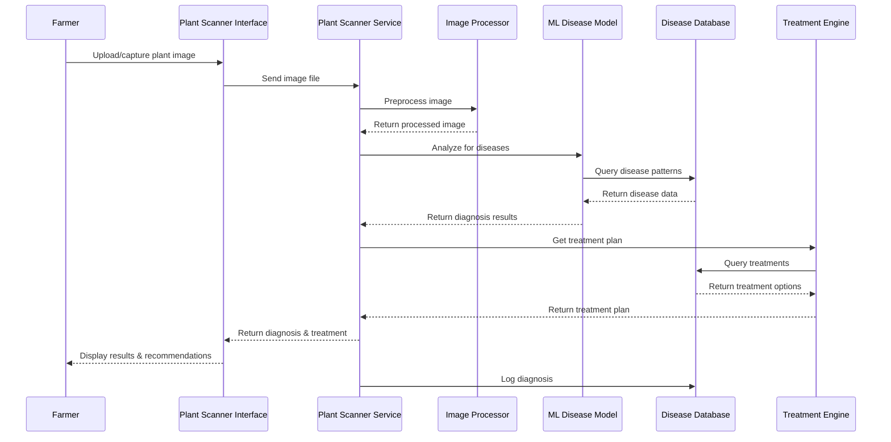

## 4. Mobile App Voice Assistant (UC-17 to UC-22)

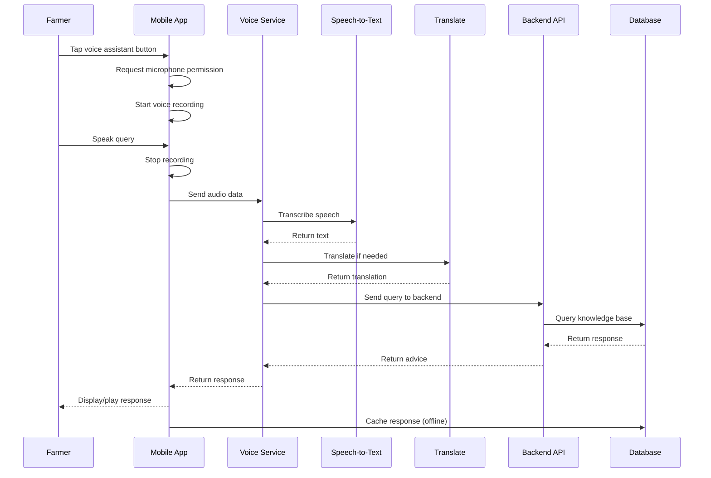

## 5. IVR System Interaction (UC-23 to UC-28)

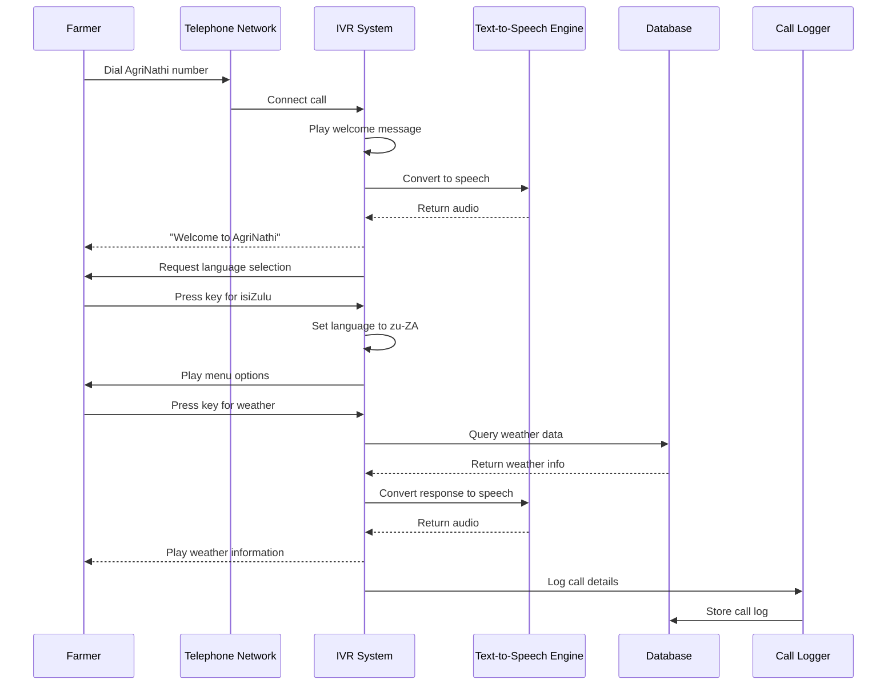

## 6. System Monitoring and Analytics

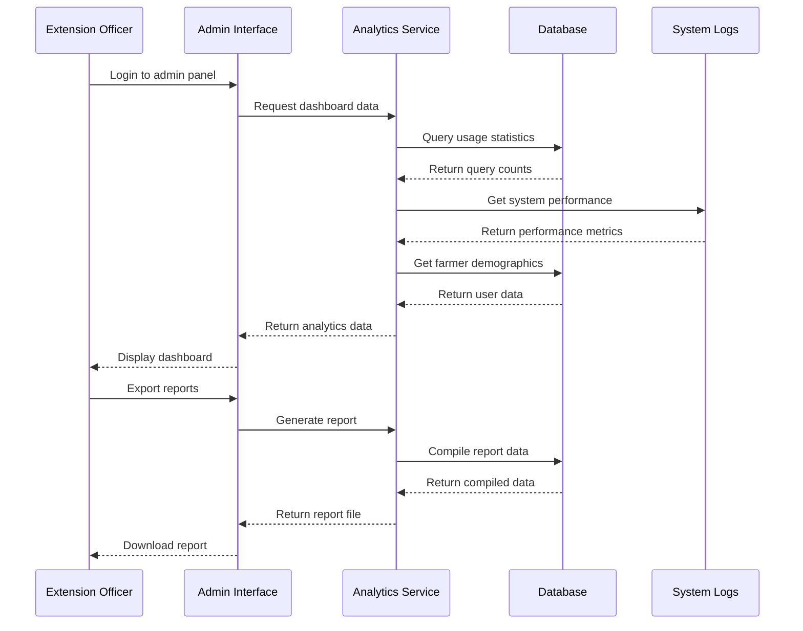

## 7. Knowledge Base Update Process

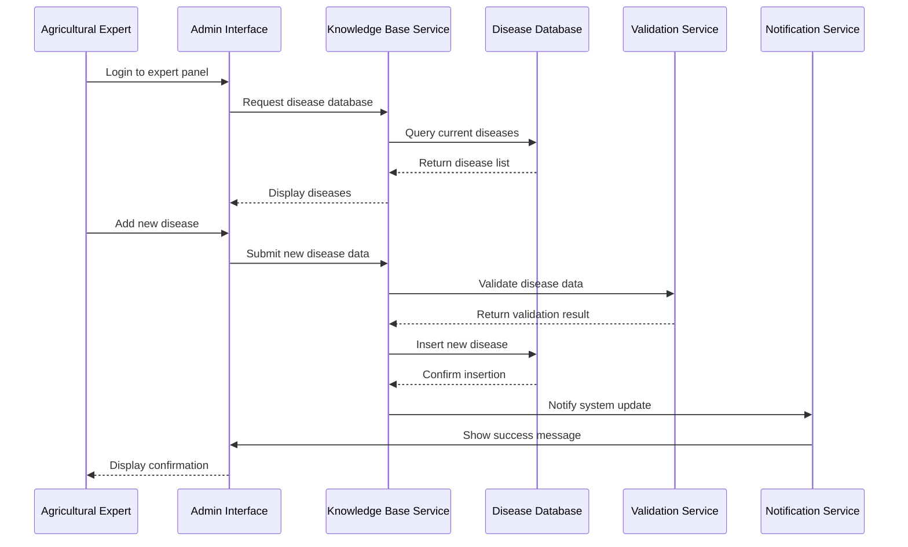

## 8. Emergency Services Access

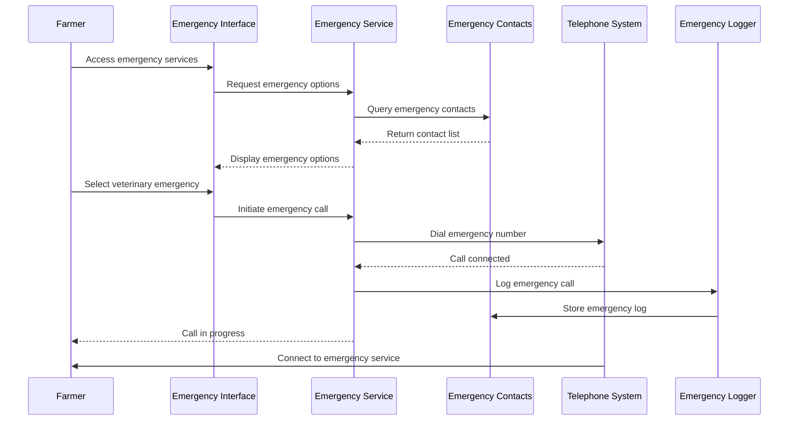

## Common Patterns

### Error Handling Pattern
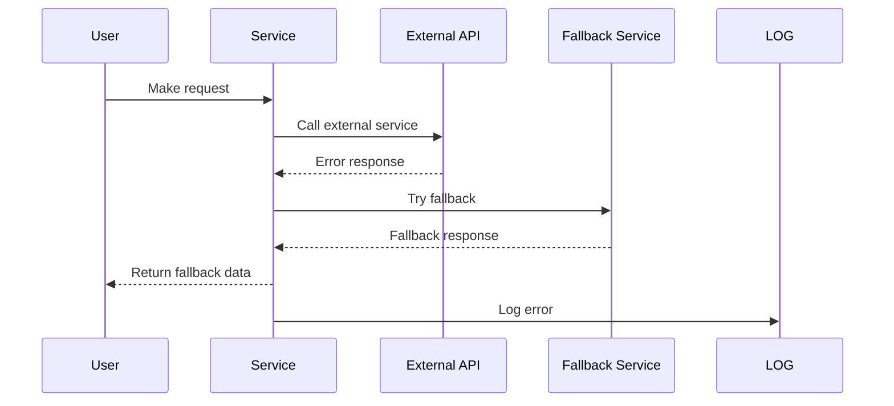

### Caching Pattern
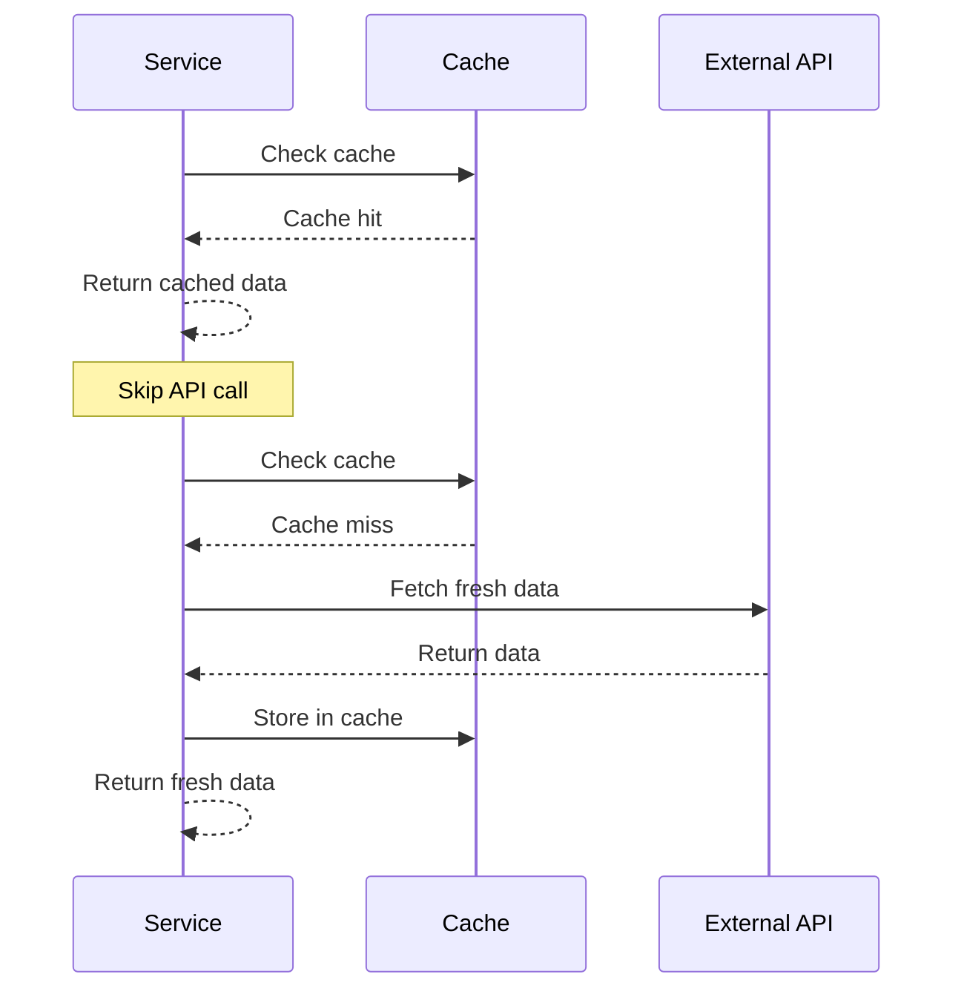

### Authentication Pattern
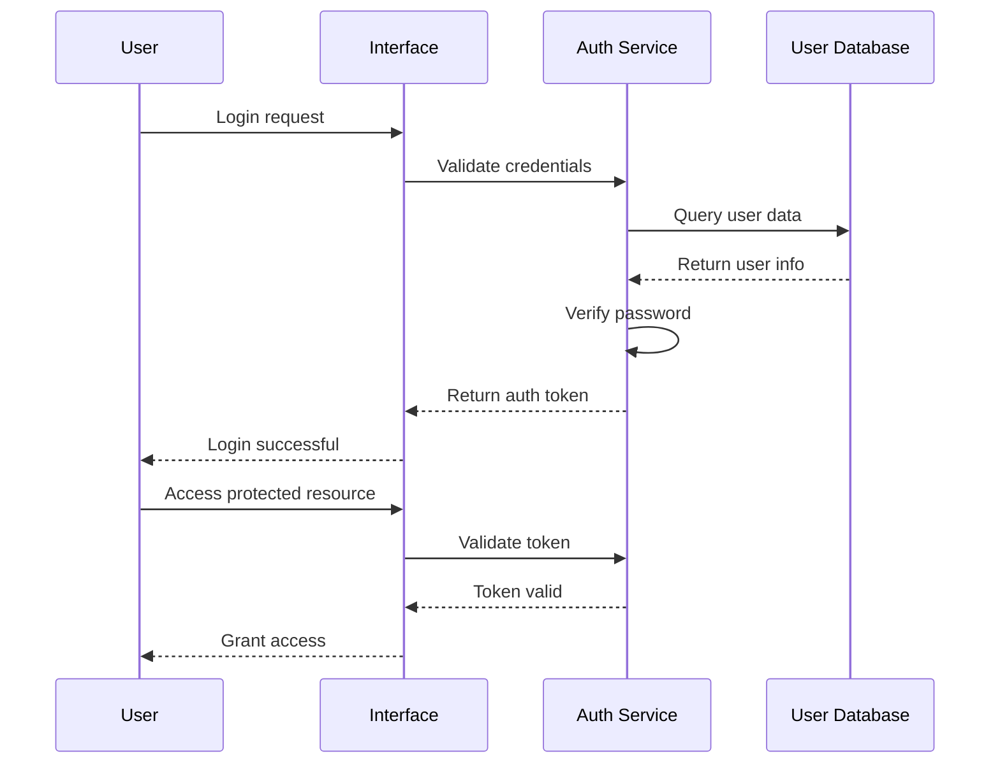

## Performance Considerations

1. **Caching**: Weather data cached for 30 minutes
2. **Async Processing**: Image analysis runs asynchronously
3. **Database Indexing**: Query logs indexed by timestamp and user
4. **CDN**: Static assets served via CDN
5. **Load Balancing**: API calls distributed across multiple servers

## Security Measures

1. **Input Validation**: All user inputs validated
2. **Rate Limiting**: API calls limited per user
3. **Encryption**: Sensitive data encrypted in transit and at rest
4. **Audit Logging**: All system interactions logged
5. **Access Control**: Role-based permissions for admin functions