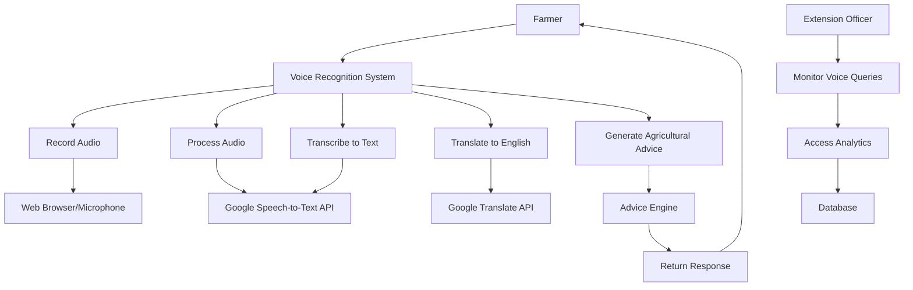
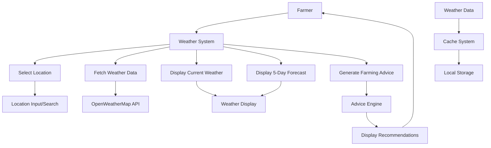
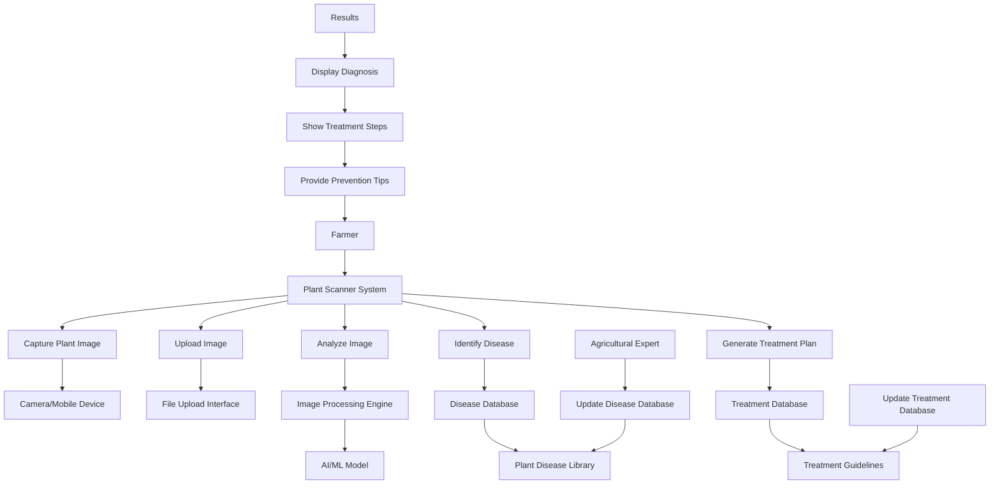
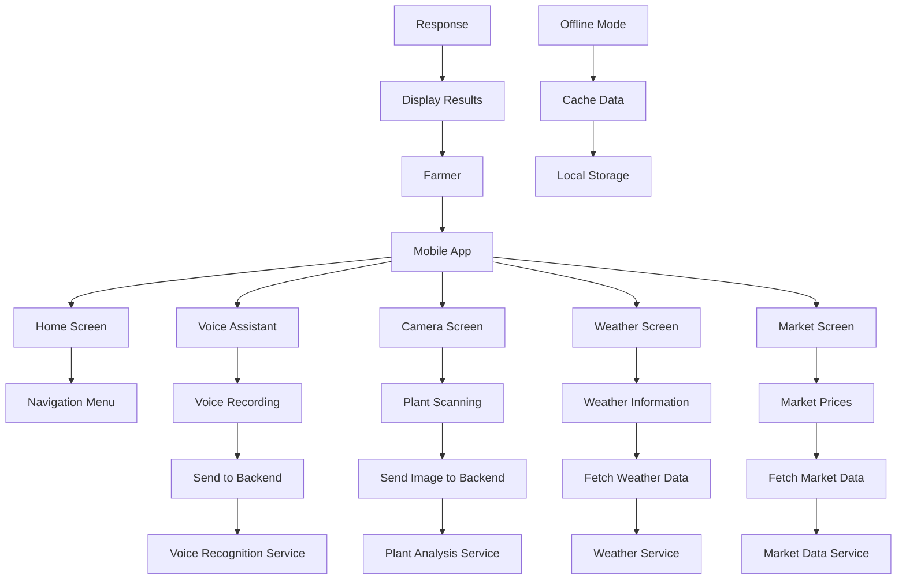
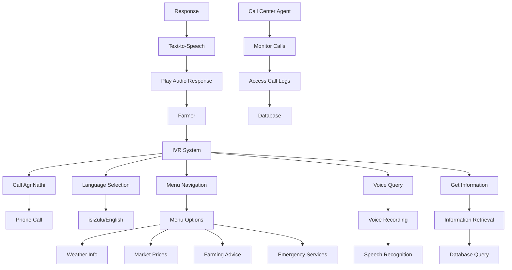

# AgriNathi System - Use Case Diagrams

## Overview
AgriNathi is an agricultural voice assistant system that provides farmers with voice-based agricultural advice, weather information, plant disease detection, and market data. The system consists of multiple modules working together to serve farmers in rural areas.

## System Modules

### 1. Voice Recognition Module

**Use Cases:**
- **UC-1:** Record Voice Query
- **UC-2:** Transcribe isiZulu Speech
- **UC-3:** Translate to English
- **UC-4:** Generate Agricultural Advice
- **UC-5:** Monitor System Usage

### 2. Weather Information Module

**Use Cases:**
- **UC-6:** Search Weather by Location
- **UC-7:** View Current Weather
- **UC-8:** View Weather Forecast
- **UC-9:** Get Weather-based Farming Advice
- **UC-10:** Cache Weather Data

### 3. Plant Disease Scanner Module

**Use Cases:**
- **UC-11:** Capture Plant Image
- **UC-12:** Upload Plant Image
- **UC-13:** Analyze Plant Disease
- **UC-14:** View Diagnosis Results
- **UC-15:** Get Treatment Recommendations
- **UC-16:** Update Disease Database

### 4. Mobile Application Module

**Use Cases:**
- **UC-17:** Navigate App Sections
- **UC-18:** Use Voice Assistant
- **UC-19:** Scan Plants with Camera
- **UC-20:** Check Weather Information
- **UC-21:** View Market Prices
- **UC-22:** Work Offline

### 5. IVR (Interactive Voice Response) Module

**Use Cases:**
- **UC-23:** Make Phone Call
- **UC-24:** Select Language
- **UC-25:** Navigate IVR Menu
- **UC-26:** Ask Voice Query
- **UC-27:** Receive Audio Response
- **UC-28:** Access Emergency Services

## Actor Definitions

### Primary Actors:
- **Farmer:** Main user of the system, seeks agricultural information and advice
- **Agricultural Expert:** Updates disease databases and treatment information
- **Extension Officer:** Monitors system usage and provides oversight

### Secondary Actors:
- **Google Speech-to-Text API:** Converts speech to text
- **Google Translate API:** Translates between languages
- **OpenWeatherMap API:** Provides weather data
- **Mobile Device:** Provides camera and GPS functionality
- **Phone System:** Enables IVR functionality

## System Boundaries

The AgriNathi system integrates with multiple external services:
- Cloud speech and translation services
- Weather data providers
- Mobile device capabilities
- Telephone networks
- Local databases for agricultural knowledge